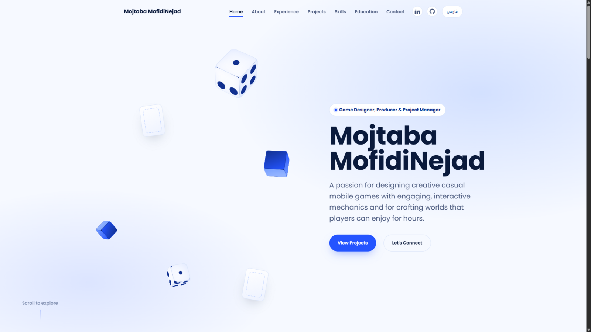

# 🎮 Mojtaba MofidiNejad

### Game Designer & Producer

 

---

Designing and shipping mobile games — from gameplay systems and level design to production and
launch. This repository is the source for my personal portfolio: a bilingual (English / فارسی),
single-page site built to show the work rather than talk about it.

## ✨ Highlights

- 🌐 **Bilingual by default** — full English / Persian experience with proper RTL layout, not a
  translated afterthought
- 🎲 **A designer's hero** — a light CSS-only 3D scene (dice, cubes, cards) instead of a stock photo
- ⚡ **Genuinely lightweight** — vanilla HTML/CSS/JS, no framework, no build step, self-hosted fonts
- 🧩 **Content-driven** — every project, role, and skill lives in JSON, so the site updates without
  touching a line of markup
- ♿ **Built to be usable** — keyboard navigation, reduced-motion support, real focus states

## 🕹️ Selected Work

Puzzle, merge, and casual mobile titles — see the [live site](https://me.jollypanda.ir/bio/mojtabamofidinejad#projects)
for the current lineup and details on each.

## 📬 Get in Touch

- **Email:** [mojii72.3d@gmail.com](mailto:mojii72.3d@gmail.com)
- **LinkedIn:** [mojtaba-mofidinejad](https://www.linkedin.com/in/mojtaba-mofidinejad-23a32a237/)
- **GitHub:** [@MojtabaMofidiNezhad](https://github.com/MojtabaMofidiNezhad)

---

Code in this repository is MIT licensed. Personal content — name, likeness, career history,
and project details — is not licensed for reuse.

